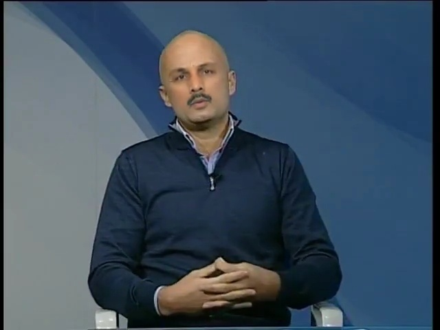

# 🛡️ Aegis: Deepfake Detection Preprocessing Pipeline

Aegis is a comprehensive video preprocessing pipeline for deepfake detection. It streamlines the crucial first phase of deepfake classification: extracting meaningful facial features from videos with high-quality enhancements and robust frame selection.

## 🚀 Key Features

- 📤 Upload video files and automatically extract frames
- 🎯 Detect and crop faces using MTCNN (with fallback logic)
- 🧠 Temporal filtering to remove near-identical consecutive frames
- 🎨 Enhance facial regions via:
  - JPEG compression artifact simulation
  - Histogram equalization (contrast boosting)
- 🗂️ Organize outputs cleanly into:
  - Raw extracted frames
  - Enhanced cropped faces

---

## ⚙️ How It Works

### 1. 🎥 Video Upload & Frame Extraction
- Upload an `.mp4` file via Google Colab.
- Frames are extracted every 30 frames (~1 per second).

### 2. 🧍 Face Detection & Cropping
- Uses **MTCNN** from `facenet-pytorch` for accurate facial bounding boxes.
- If MTCNN fails, falls back to a standard detector.

### 3. ⏱️ Temporal Filtering
- Compares frame differences to skip almost identical consecutive frames using pixel-wise MSE.

### 4. ✨ Face Enhancement
- Simulates **JPEG compression artifacts** to mimic real-world social media degradation.
- Applies **histogram equalization** to enhance contrast and reveal finer facial details.

---

## 🖼️ Sample Output

<table>
  <tr>
    <td><strong>Original Frame</strong></td>
    <td><strong>Cropped Face</strong></td>
    <td><strong>Enhanced Face</strong></td>
  </tr>
  <tr>
    <td></td>
    <td></td>
    <td></td>
  </tr>
</table>

---

## 🧰 Tech Stack

- Python 🐍
- OpenCV
- MTCNN (facenet-pytorch)
- NumPy
- Matplotlib
- Google Colab

---

## 🔍 Potential Extensions

> (To be implemented in future stages or if assigned)

- CNN or Transformer-based deepfake classification
- Face alignment
- Eye-blink or head-motion detection
- Temporal modeling (e.g., LSTM, 3D-CNN)
- Mobile deployment or web-based demo

---

## 👩‍💻 Author

**Anjika Prasad**  
Machine Learning Enthusiast | VIT Vellore  
🔗 [LinkedIn](www.linkedin.com/in/anjika-prasad-9b393b331)| 📧 anjikapd9106@email.com

---

## 📝 License

MIT License. Feel free to use, fork, and contribute to this repo.

